# 🧠 CogniFlow Adaptive Learning Platform

An AI-powered adaptive learning platform designed to deliver personalized learning experiences through intelligent recommendations, adaptive assessments, cognitive analytics, and role-based learning environments.

The platform helps learners progress efficiently by analyzing learning behavior, tracking mastery levels, and providing customized educational pathways.

---

## 🚀 Key Features

### 👨‍🎓 Learner Module

* Personalized learning dashboard
* Adaptive course recommendations
* AI-powered tutor assistance
* Interactive quizzes and assessments
* Progress tracking and performance analytics
* Learning streak monitoring
* Mastery-based learning paths

### 👨‍💼 Admin Module

* User management
* Course management
* Quiz management
* Platform analytics
* Learning insights dashboard
* Content moderation

### 👨‍🏫 Creator Module

* Course creation and publishing
* Quiz creation and management
* Content analytics
* Learner performance monitoring
* Content lifecycle management

### 🤖 AI Features

* AI Tutor
* Adaptive Learning Recommendations
* Knowledge Graph Visualization
* Performance Analytics
* Intelligent Learning Support

---

# 📸 Application Screenshots

## Learner Module

### Learner Dashboard

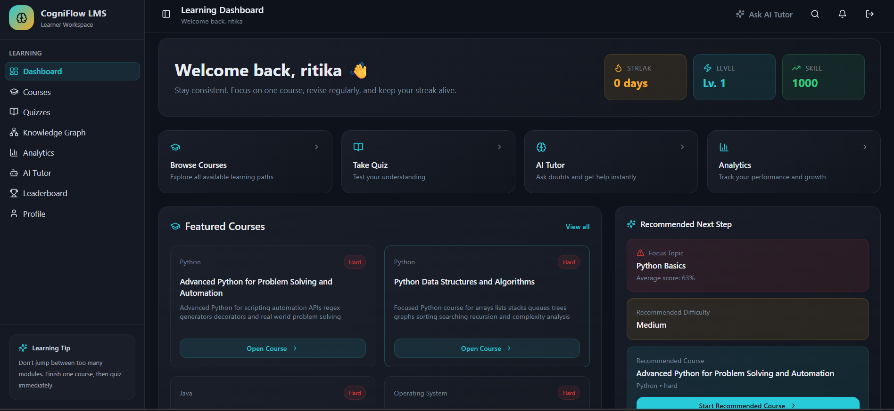

### Learner Courses

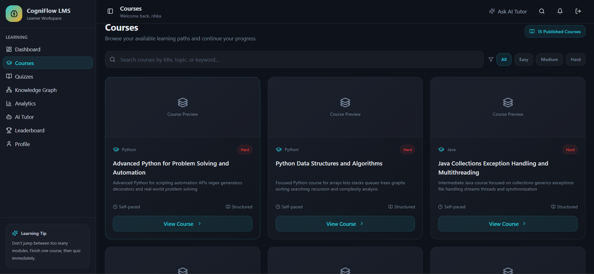

### Learner Quizzes

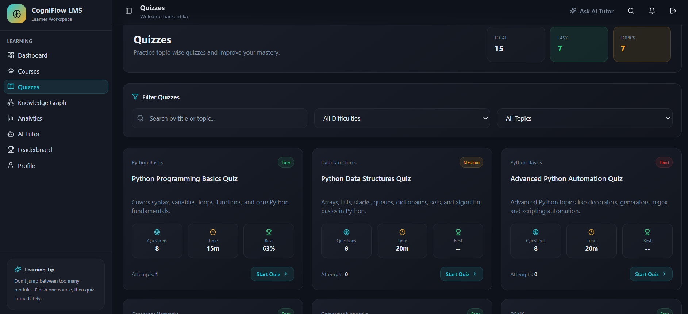

### AI Tutor

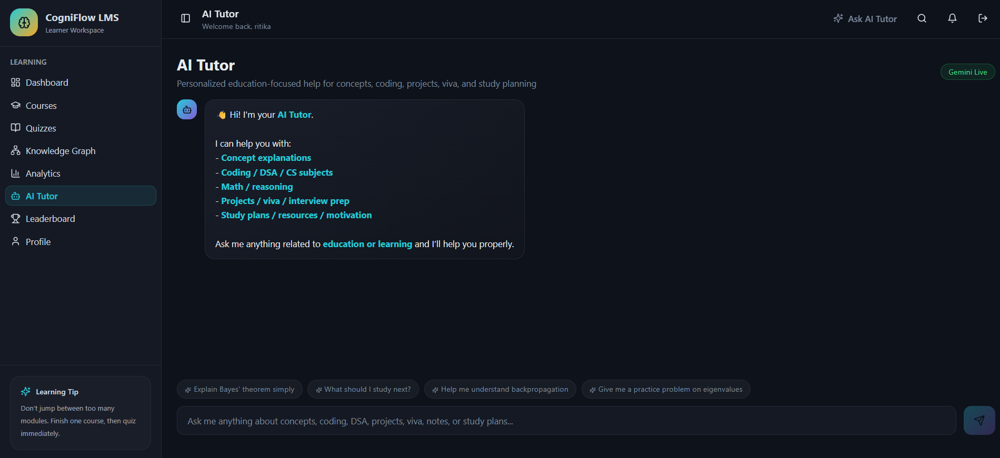

---

## Admin Module

### Admin Dashboard

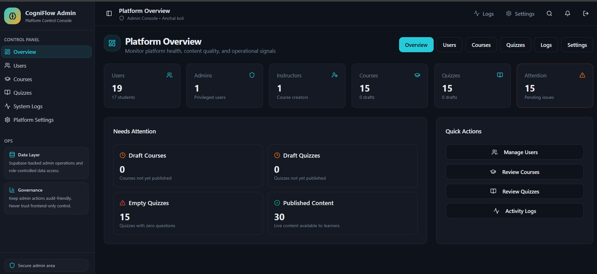

### User Management

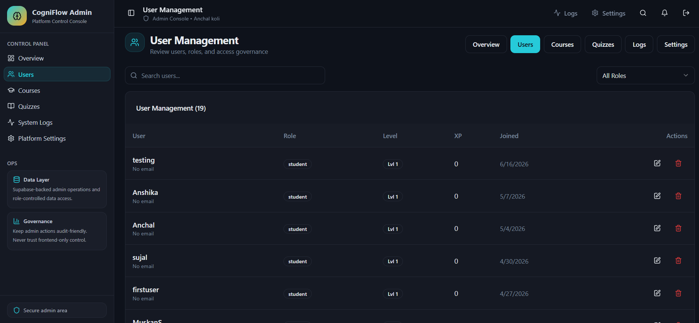

### Course Management

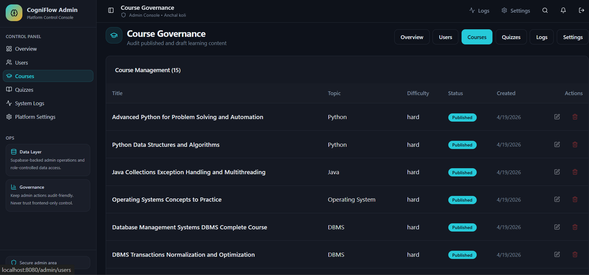

### Quiz Management

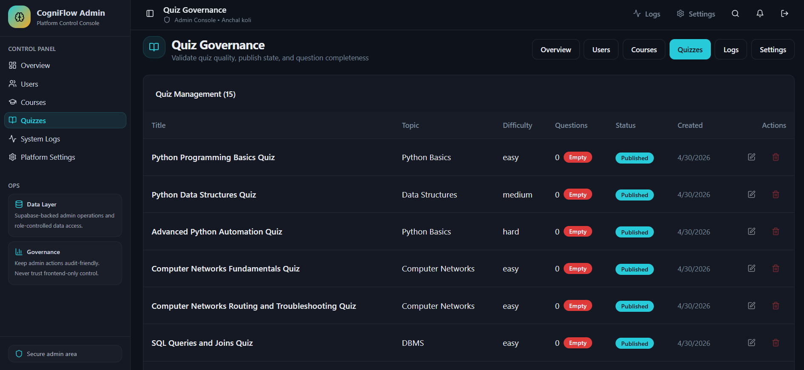

---

## Creator Module

### Creator Dashboard

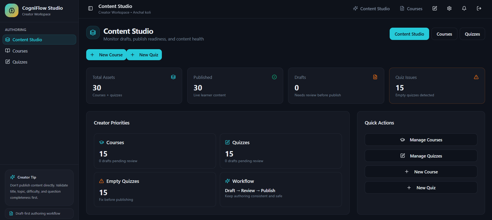

### Creator Courses

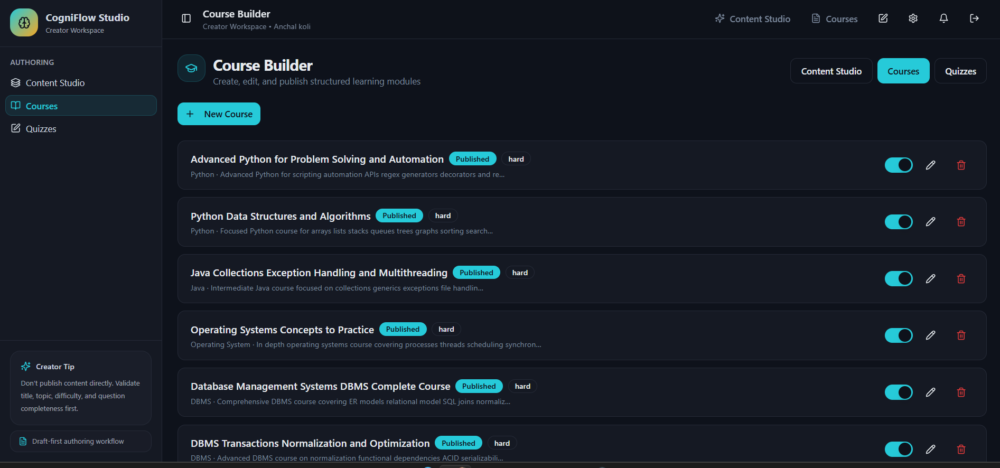

### Creator Quiz Management

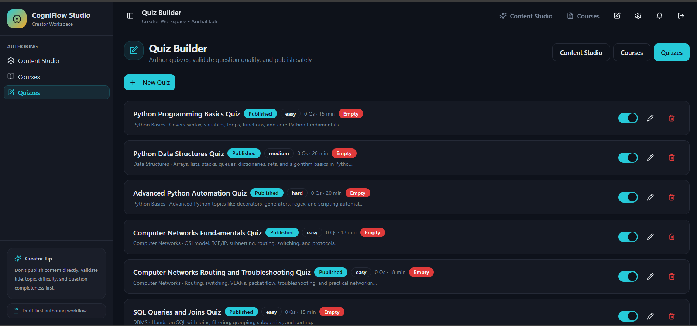

---

## Knowledge Graph

### Learning Knowledge Graph


---

# 🏗️ System Architecture

```text
                     ┌─────────────────┐
                     │     Frontend    │
                     │ React + Vite TS │
                     └────────┬────────┘
                              │
                              ▼
                    ┌──────────────────┐
                    │ Supabase Auth    │
                    └────────┬─────────┘
                             │
                             ▼
                    ┌──────────────────┐
                    │ PostgreSQL DB    │
                    └────────┬─────────┘
                             │
                             ▼
                 ┌─────────────────────────┐
                 │ Learning Analytics      │
                 │ Recommendation Engine   │
                 └───────────┬─────────────┘
                             │
                             ▼
                  Personalized Learning
```

---

# 🛠️ Technology Stack

## Frontend

* React
* TypeScript
* Vite
* React Router DOM
* Tailwind CSS
* Framer Motion
* Lucide React

## Backend Services

* Supabase
* PostgreSQL
* Supabase Authentication
* Supabase Storage
* Supabase Realtime

## State Management

* TanStack Query
* React Hooks

## Development Tools

* Git
* GitHub
* VS Code

---

# 📂 Project Structure

```text
src/
├── components/
├── pages/
│   ├── learner/
│   ├── admin/
│   └── creator/
├── layouts/
├── hooks/
├── integrations/
│   └── supabase/
├── data/
├── lib/
├── App.tsx
└── main.tsx

screenshots/
├── admin-dashboard.png
├── admin-users.png
├── admin-course.png
├── admin-quiz.png
├── creator-dashboard.png
├── creator-courses.png
├── creator-quiz.png
├── learner-dashboard.png
├── learner-courses.png
├── learner-quizzes.png
├── ai-tutor.png
└── knowledge-graph.png
```

---

# ⚙️ Installation

## Clone Repository

```bash
git clone https://github.com/Anchal-Koli/CogniFlow-Adaptive.git
```

## Navigate to Project

```bash
cd CogniFlow-Adaptive
```

## Install Dependencies

```bash
npm install
```

## Configure Environment Variables

Create a `.env` file in the root directory:

```env
VITE_SUPABASE_URL=your_supabase_project_url
VITE_SUPABASE_PUBLISHABLE_KEY=your_supabase_publishable_key
```

## Run Development Server

```bash
npm run dev
```

## Create Production Build

```bash
npm run build
```

---

# 🔐 Authentication

The platform uses Supabase Authentication for:

* Secure user registration
* User login and logout
* Session management
* Protected routes
* Role-based access control

---

# 🎯 Future Enhancements

* AI-generated quizzes
* Learning behavior prediction
* Cognitive profile analysis
* Gamification system
* Real-time collaboration
* Personalized AI study plans
* Advanced recommendation engine
* Learning outcome forecasting

---

# 👩‍💻 Author

**Anchal Koli**

B.Tech Computer Science Engineering (AI & ML)

---

# ⭐ Support

If you found this project useful, please consider giving it a ⭐ on GitHub.

## ✨ README Improvement Notes

### 📌 Formatting Enhancements Needed
- Improve heading hierarchy for better readability
- Ensure consistent spacing between sections
- Use proper Markdown formatting for code blocks and lists
- Align all installation and usage steps properly

### 🚀 Suggested Structure Upgrade
- Introduction
- Features
- Tech Stack
- Installation
- Usage
- Project Structure
- Contribution Guidelines
- License

### 🛠️ Documentation Improvements
- Add badges (optional): build, license, contributors
- Add screenshots for better UI understanding
- Standardize code blocks for commands

### 🎯 Goal
Improve onboarding experience for new contributors and users by making README more structured, readable, and professional.

